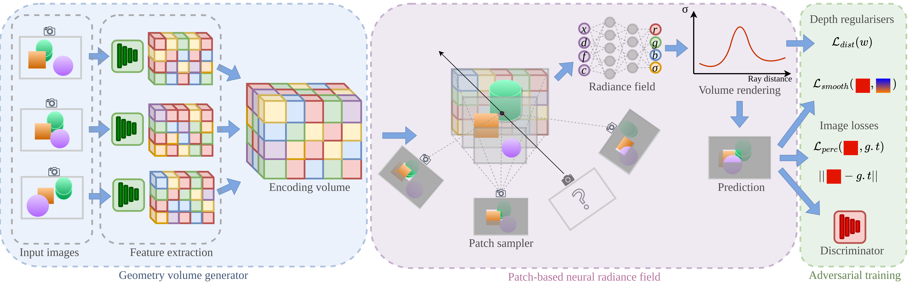

# SVS: Adversarial refinement for sparse novel view synthesis
PyTorch Lightning implementation of paper "SVS: Adversarial refinement for sparse novel view synthesis", published at BMVC 2022. Research carried at the Centre for Vision Speech and Signal Processing at the University of Surrey, and BBC Research and Development.

> SVS: Adversarial refinement for sparse novel view synthesis  
> [Violeta Menéndez González](https://github.com/violetamenendez), [Andrew Gilbert](https://www.andrewjohngilbert.co.uk/), [Graeme Phillipson](https://www.bbc.co.uk/rd/people/graeme-phillipson), [Stephen Jolly](https://www.bbc.co.uk/rd/people/s-jolly), [Simon Hadfield](http://personal.ee.surrey.ac.uk/Personal/S.Hadfield/biography.html)  
> BMVC 2022
>

#### [Paper](https://arxiv.org/abs/2211.07301) | [Poster](http://personal.ee.surrey.ac.uk/Personal/S.Hadfield/posters/Menendez22b_poster.pdf) | [Video](http://personal.ee.surrey.ac.uk/Personal/S.Hadfield/videos/Menendez22b_video.mp4)



## Installation

#### Tested on Ubuntu 20.04 + Python 3.8 + Pytorch 1.10.1 + Pytorch Lightning 1.5.8

```
conda env create -f environment.yml
```

Alternatively, you can install the conda environment manually:
```
conda create -n svs python=3.8 pip
conda activate svs
conda install pytorch==1.12.1 torchvision==0.13.1 torchaudio==0.12.1 cudatoolkit=11.3 -c pytorch
python -m pip install pytorch-lightning==1.5.8
conda install pillow scipy
python -m pip install inplace_abn kornia
python -m pip install configargparse imageio opencv-python lpips coloredlogs
```

## Datasets

### 1. Training datasets

#### (a) [**DTU**](https://roboimagedata.compute.dtu.dk/?page_id=36)
Download the preprocessed [DTU training data](https://drive.google.com/file/d/1eDjh-_bxKKnEuz5h-HXS7EDJn59clx6V/view)
and [Depth_raw](https://virutalbuy-public.oss-cn-hangzhou.aliyuncs.com/share/cascade-stereo/CasMVSNet/dtu_data/dtu_train_hr/Depths_raw.zip) from original [MVSNet repo](https://github.com/YoYo000/MVSNet)
and unzip. We provide an example in `dtu/`.

#### (b) [**LLFF**](https://bmild.github.io/llff/) released scenes
Download and process [real_iconic_noface.zip](https://drive.google.com/drive/folders/1M-_Fdn4ajDa0CS8-iqejv0fQQeuonpKF) (6.6G) using the following commands:
```angular2
# download
gdown https://drive.google.com/uc?id=1ThgjloNt58ZdnEuiCeRf9tATJ-HI0b01
unzip real_iconic_noface.zip
```

### 2. Test datasets
Download `nerf_llff_data.zip` from [here](https://drive.google.com/drive/folders/128yBriW1IG_3NJ5Rp7APSTZsJqdJdfc1) and add it to your LLFF folder

## Training
You can train your own model using the following command with your own parameters:
```
python train.py --expname $exp_name --num_epochs $num_epochs --use_viewdirs --dataset_name $dataset --datadir $datasdir --save_dir $save_dir --configdir $config_dir --batch_size $batch_size --patch_size $patch_size --precision $precision --gan_loss $gan_loss --gan_type $gan_type --lambda_rec $lambda_rec --with_distortion_loss --lambda_distortion $l_dist --with_depth_smoothness --lambda_depth_smooth $l_ds --pts_embedder --lambda_adv $l_adv --with_perceptual_loss --lambda_perc $l_perc --lrate $lrate --lrate_disc $lrate_disc
```
To reproduce the paper results you can run the following command, where `$dataset` is either `dtu` or `llff`. DTU model was trained for 4 epochs, and LLFF was trained for 140 epochs:
```
python train.py --expname $exp_name --num_epochs $epochs --use_viewdirs --dataset_name $dataset --datadir $datadir --save_dir $save_dir --configdir $config_dir --batch_size 4096 --patch_size 64 --precision 32 --gan_loss lsgan --gan_type graf --lambda_rec 20 --with_distortion_loss --lambda_distortion 0.001 --with_depth_smoothness --lambda_depth_smooth 0.4 --pts_embedder --lambda_adv 1 --with_perceptual_loss --lambda_perc 1 --lrate 5e-4 --lrate_disc 1e-4
```

## Testing
```
python test.py --expname $exp_name --num_epochs 1 --use_viewdirs --save_dir $save_dir --dataset_name $dataset --datadir $data_dir --configdir $config_dir --ckpt $ckpt --pts_embedder
```

## Citation
```
@inproceedings{menendez2022svs,
  author    = {Menéndez González, Violeta and Gilbert, Andrew and Phillipson, Graeme and Jolly, Stephen and Hadfield, Simon},
  title     = {SVS: Adversarial Refinement for Sparse Novel View Synthesis},
  booktitle = {BMVC},
  year      = {2022}
}

```

## Relevant Works
[**MVSNeRF: Fast Generalizable Radiance Field Reconstruction from Multi-View Stereo (ICCV 2021)**](https://arxiv.org/abs/2103.15595)<br>
Anpei Chen, Zexiang Xu, Fuqiang Zhao, Xiaoshuai Zhang, Fanbo Xiang, Jingyi Yu, Hao Su

[**GRAF: Generative Radiance Fields for 3D-Aware Image Synthesis (NeurIPS 2020)**](https://arxiv.org/abs/2007.02442)<br>
Katja Schwarz, Yiyi Liao, Michael Niemeyer, Andreas Geiger

[**Mip-NeRF 360: Unbounded Anti-Aliased Neural Radiance Fields (CVPR 2022)**](https://arxiv.org/abs/2111.12077)<br>
Jonathan T. Barron, Ben Mildenhall, Dor Verbin, Pratul P. Srinivasan, Peter Hedman

[**MVSNet: Depth Inference for Unstructured Multi-view Stereo (ECCV 2018)**](https://arxiv.org/abs/1804.02505)<br>
Yao Yao, Zixin Luo, Shiwei Li, Tian Fang, Long Quan

[**NeRF: Representing Scenes as Neural Radiance Fields for View Synthesis (ECCV 2020)**](http://www.matthewtancik.com/nerf)<br>
Ben Mildenhall, Pratul P. Srinivasan, Matthew Tancik, Jonathan T. Barron, Ravi Ramamoorthi, Ren Ng

[**IBRNet: Learning Multi-View Image-Based Rendering (CVPR 2021)**](https://ibrnet.github.io/)<br>
Qianqian Wang, Zhicheng Wang, Kyle Genova, Pratul Srinivasan, Howard Zhou, Jonathan T. Barron, Ricardo Martin-Brualla, Noah Snavely, Thomas Funkhouser

[**RegNeRF: Regularizing Neural Radiance Fields for View Synthesis From Sparse Inputs (CVPR 2022)**](https://arxiv.org/abs/2112.00724)<br>
Michael Niemeyer, Jonathan T. Barron, Ben Mildenhall, Mehdi S. M. Sajjadi, Andreas Geiger, Noha Radwan